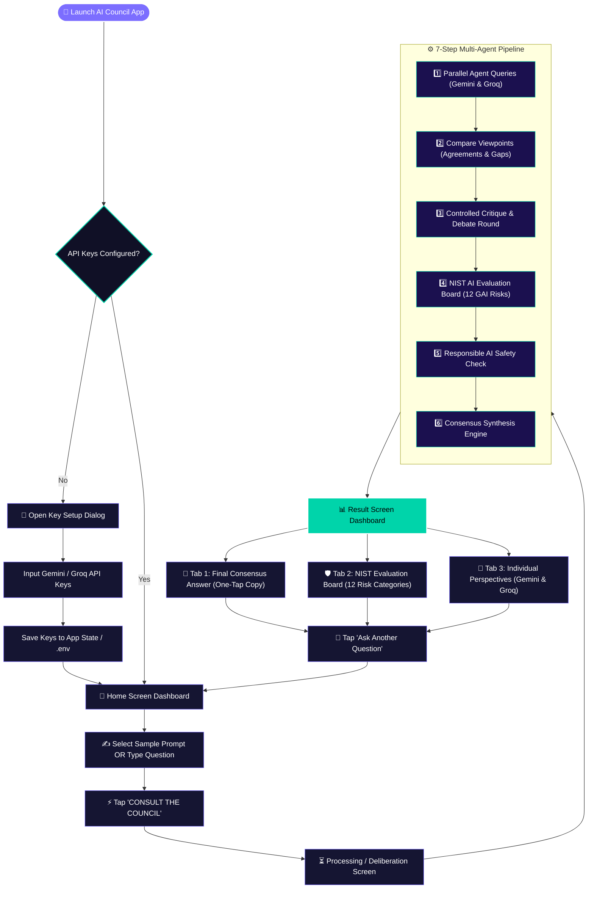
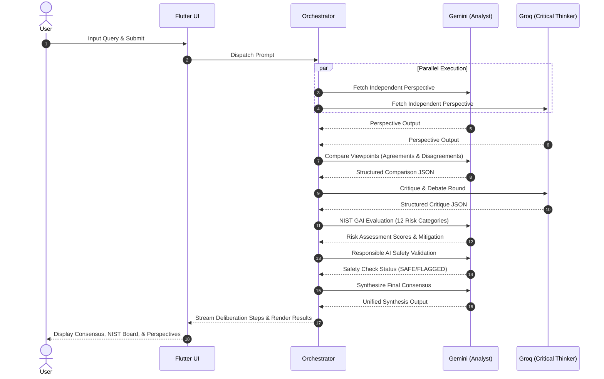

# 🏛️ AI COUNCIL

**Multiple AI Perspectives. One Better Answer.**

AI Council is a multi-agent AI collaboration and deliberation system built with Flutter. It submits user queries to independent frontier AI models (Gemini & Groq), compares their insights, evaluates responses against the **NIST GAI Risk-Informed Assessment Board (12 Risk Categories)**, performs safety checks, and synthesizes a unified consensus answer.

---

## 🗺️ User Flow Chart

The following diagram illustrates the complete user journey and interactive pipeline within the application:



---

## ⚡ Multi-Agent Pipeline Architecture



---

## 🌟 Key Features

1. **Multi-Agent Diversity:** Integrates Google Gemini (`gemini-1.5-flash`) as the Primary Analyst & Synthesizer, and Groq (`llama-3.3-70b-versatile`) as the Critical Thinker.
2. **NIST AI Evaluation Board:** Vets AI outputs against the 12 NIST GAI Risk-Informed Categories (Confabulation, Information Integrity, Information Security, Data Privacy, Harmful Bias, CBRN, etc.).
3. **Response Comparison & Critique:** Identifies common ground, surfaces conflicting perspectives, and executes controlled critique loops to eliminate blind spots.
4. **Single-Provider Fallback:** Seamlessly operates with a single provider if only one key is available without fabricating consensus.
5. **Modern Dark Glassmorphism UI:** Built with Material 3, Google Fonts (Inter), smooth animations, tabbed results, and one-tap copy functionality.

---

## 🚀 Quick Start

### Prerequisites
- Flutter SDK (>=3.13.2)
- Google Chrome or Android Studio / Emulator

### 1. Clone & Set Up Environment
Create a `.env` file in the project root:
```env
GEMINI_API_KEY=your_gemini_api_key_here
GROQ_API_KEY=your_groq_api_key_here
```

### 2. Install Dependencies
```bash
cd ai_council
flutter pub get
```

### 3. Run on Chrome
```bash
flutter run -d chrome
```

---

## 🧪 Testing & Code Quality

Run tests and static analysis:
```bash
flutter test
flutter analyze
```

---

## 📜 License
Developed for Hackathon MVP demonstration.
